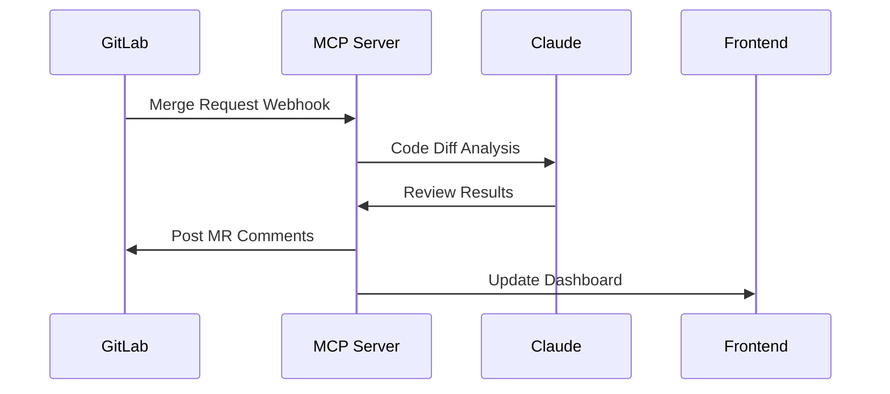

# **GitLab Code Review Terraform Module + Frontend Application**

This expanded solution provides:
- **Terraform Module** for deploying to any GitLab project
- **React Frontend** for interactive code reviews
- **GitLab CI/CD Integration**
- **Customizable Review Policies**

## **📂 Enhanced Project Structure**
```bash
gitlab-code-reviewer/
├── terraform/               # Infrastructure as Code
│   ├── main.tf              # GitLab integration
│   ├── variables.tf         # Customizable rules
│   └── outputs.tf
├── frontend/                # React Dashboard
│   ├── src/
│   │   ├── hooks/useReview.js
│   │   └── components/Reviewer.js
│   └── Dockerfile
├── server/                  # Expanded MCP Server
│   ├── policies/            # Rule templates
│   └── gitlab-adapter.py    # Webhook handler
└── sample-policies/         # Example rule sets
```

## **1. Terraform Module (GitLab Integration)**
### `terraform/main.tf`
```hcl
module "code_review_bot" {
  source = "./modules/code-reviewer"

  gitlab_project_id = "12345"
  claude_model_size = "sonnet" # or 'haiku'
  review_policies = [
    file("${path.module}/policies/security.hcl"),
    file("${path.module}/policies/performance.hcl")
  ]
}

resource "gitlab_project_hook" "review_hook" {
  project    = var.gitlab_project_id
  url        = module.code_review_bot.webhook_url
  push_events = true
  merge_requests_events = true
}
```

### Key Features:
- **Auto-deploys Claude reviewer** to any GitLab project
- **Policy-as-Code** with HCL configuration
- **Webhook integration** for automatic reviews

## **2. React Frontend Application**
### `frontend/src/components/Reviewer.js`
```jsx
import { useGitLabMR } from '../hooks/useReview';

export default function Reviewer({ projectId }) {
  const { comments, scores, loading } = useGitLabMR(projectId);

  return (
    <div className="review-container">
      <h3>Claude Code Review</h3>
      <div className="score-cards">
        <ScoreCard title="Security" value={scores.security} />
        <ScoreCard title="Performance" value={scores.performance} />
      </div>
      <CommentList items={comments} />
    </div>
  );
}
```

### Key Features:
- **Real-time MR diffs analysis**
- **Interactive feedback interface**
- **Historical review dashboard**

## **3. GitLab CI/CD Integration**
### `.gitlab-ci.yml` Example
```yaml
stages:
  - review

claude_review:
  stage: review
  image: claude-reviewer:latest
  script:
    - claude-review --target $CI_MERGE_REQUEST_DIFF_BASE_SHA
  rules:
    - if: $CI_PIPELINE_SOURCE == "merge_request_event"
```

## **4. Policy Configuration Examples**
### `sample-policies/security.hcl`
```hcl
policy "gitlab_security" {
  enforcement_level = "hard-mandate"
  
  rule "no_hardcoded_secrets" {
    description = "Check for AWS keys, passwords etc."
    condition  = claude.detect_secrets(code) == 0
  }
  
  rule "sql_injection" {
    condition = claude.analyze_owasp(code, "SQLi") == "clean"
  }
}
```

## **5. Expanded MCP Server**
### `server/gitlab-adapter.py`
```python
def handle_gitlab_webhook(payload):
    changes = payload.get('changes', {})
    if 'diffs' in changes:
        analysis = analyze_diff(
            changes['diffs'],
            language=detect_language(payload['project']['path_with_namespace']),
            policy=load_policy(payload['project_id'])
        )
        return create_gitlab_comments(analysis)
```

## **Deployment Workflow**


## **Key Benefits**
1. **Terraform Module** enables one-click deployment
2. **Custom Policies** adapt to team standards
3. **Full CI/CD Integration** with native GitLab flow
4. **Visual Dashboard** for tracking improvements

Would you like me to develop any specific component further? Such as:
- Detailed Terraform module variables
- Frontend authentication with GitLab OAuth
- Custom policy builder UI